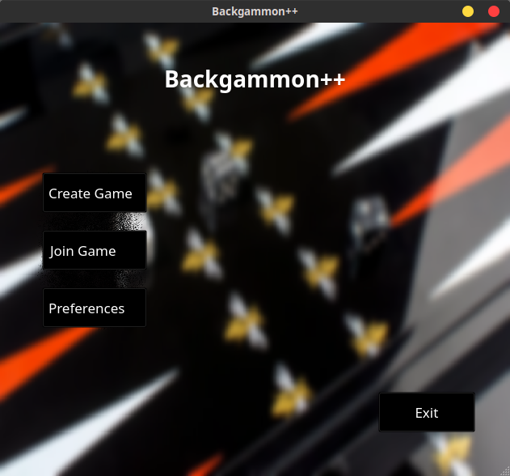
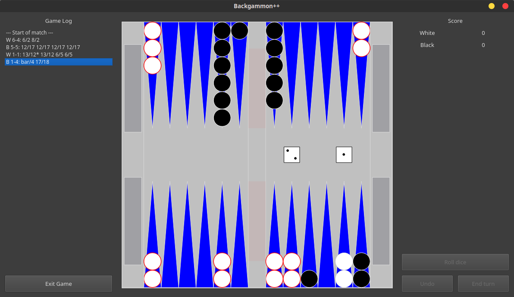

# Backgammon++

  
  

Online Backgammon multiplayer game written in C++ using QT framework.

Backgammon++ supports multiple game modes - playing online, playing against our custom built neural network, or playing locally (2 players using the same machine to take turns). 

Whole project was done for other course but we will focus on the BackgammonPP/engine/bot for this course purpose.

Additionally, Backgammon++ also includes multiple games played on the [tables](https://en.wikipedia.org/wiki/Tables_game) board:
- [Backgammon](https://en.wikipedia.org/wiki/Backgammon)
- [Long Nardy](https://en.wikipedia.org/wiki/Long_Nardy)

